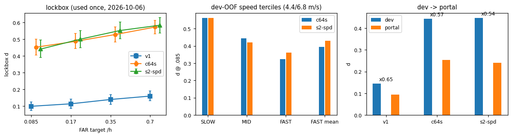
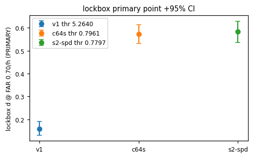

# ML-RADAI: от matched-фильтра к временной свёрточной сети на RADAI v4.3

[English](README.md) · [Русский](README.ru.md)

Репозиторий посвящён **обнаружению и идентификации источников гамма-излучения** в
[симуляции городского поиска RADAI](https://bdc.lbl.gov/wiki/public/radai-interactive-datasets/)
(ORNL/LBNL, v4.3). Детектор NaI(Tl) на транспортном средстве проезжает по смоделированному городу; нужно выдать тревогу
при проезде мимо скрытого источника, назвать изотоп и удержать частоту ложных тревог в практически приемлемых пределах.
Оценка выполняется **официальными метриками** организаторов: полнота обнаружения `d_recall` при заданном числе
ложных тревог на час фона (`fpr`).

Основной результат — ноутбук [`RADAI_pipeline.ipynb`](RADAI_pipeline.ipynb) (выполнен, выводы сохранены; текст на русском,
комментарии в коде на английском). В нём: построчная реплика официального скорера и построителя ответного ключа; базовый
физический детектор v1 (пуассоновский matched-фильтр, 7 компонент фона, 61 шаблон изотопов, скользящий максимум 62 с);
замороженный валидационный харнесс (5-fold CV по прогонам на 240 прогонах, запечатанный локбокс из 60 прогонов, бутстрэп по
прогонам); временная свёрточная сеть (**c64s**, 547 тыс. параметров) и её вариант с аугментацией сжатия по времени
(**s2-spd**); генерация CSV для портала и три замера на слепом testing через официальный портал.

## Основные результаты

Все интервалы — 95 %-е бутстрэп-интервалы по прогонам. `d_recall` — официальная полнота обнаружения.

**Development OOF** (240 прогонов, 229.4 ч фона, предсказания out-of-fold):

| цель fpr, 1/ч | v1 (mx31) | c64s | s2-spd |
|---|---|---|---|
| 0.085 | 0.1199 [0.1062–0.1324] | 0.4435 [0.4199–0.4665] | **0.4481 [0.4225–0.4723]** |
| 0.17 | 0.1287 [0.1143–0.1420] | 0.4926 [0.4682–0.5150] | **0.5014 [0.4779–0.5247]** |
| 0.35 | 0.1481 [0.1332–0.1625] | 0.5347 [0.5123–0.5553] | **0.5440 [0.5183–0.5667]** |
| 0.70 | 0.1657 [0.1499–0.1812] | 0.5736 [0.5525–0.5948] | **0.5806 [0.5566–0.6019]** |

**Запечатанный локбокс** (60 прогонов, 57.45 ч фона; использован один раз 06.10.2026; пороги перенесены с dev;
для выводов использована только цель 0.70, 0.35 — индикативная, 0.085 и 0.17 — только для отчёта, так как содержат 5–13 ложных тревог):

| цель fpr, 1/ч | v1 (mx31) | c64s | s2-spd |
|---|---|---|---|
| 0.085 | 0.0981 [0.0734–0.1238] (fpr 0.087, FP 5) | 0.4519 [0.4049–0.5000] (fpr 0.104, FP 6) | 0.4407 [0.3892–0.4948] (fpr 0.139, FP 8) |
| 0.17 | 0.1130 [0.0856–0.1407] (fpr 0.174, FP 10) | 0.4870 [0.4428–0.5332] (fpr 0.139, FP 8) | 0.5000 [0.4485–0.5509] (fpr 0.226, FP 13) |
| 0.35 | 0.1389 [0.1101–0.1686] (fpr 0.296, FP 17) | 0.5278 [0.4831–0.5738] (fpr 0.296, FP 17) | 0.5519 [0.5027–0.6015] (fpr 0.453, FP 26) |
| 0.70 | 0.1593 [0.1309–0.1903] (fpr 0.714, FP 41) | 0.5722 [0.5311–0.6131] (fpr 0.696, FP 40) | 0.5833 [0.5358–0.6296] (fpr 1.010, FP 58) |

**Слепой testing, официальный портал** (время загрузки по часам портала):

| № | дата | модель | строк в файле | `d_recall` | `fpr`, 1/ч | удержание (testing/dev) |
|---|---|---|---|---|---|---|
| 1 `first_try` | 2026-10-02 | v1, порог 5.7492 | 413 | 0.0946 | 0.535 | 0.65 |
| 2 `second_try` | 2026-10-04 | c64s, порог 0.8617 | 727 | 0.2530 | 0.0973 | 0.570 ± 0.045 |
| 3 `third_try` | 2026-10-06 | s2-spd, порог 0.8536 | 683 | 0.2402 | 0.0730 | 0.536 [0.491–0.585] |

Что показывают числа:

* Обе сети уверенно превосходят matched-фильтр v1: разность `d_recall` на локбоксе +0.34…+0.42, нижние границы интервалов ≥ +0.29.
* **s2-spd не отличим от c64s**: dev +0.005…+0.011, локбокс +0.011 [−0.030; +0.050] при 0.70, портал −0.013 (≈1.1σ). При цели 0.70
  s2-spd на локбоксе сработал при фактическом fpr 1.01 против 0.70 у c64s, поэтому его небольшое преимущество по `d_recall`
  получено за счёт большего числа ложных тревог. Два запуска одного рецепта с разными сидами различаются по dev-`d_recall` на 0.061
  при цели 0.085, поэтому меньшие различия не считаются значимыми.
* При переходе от dev к слепому testing сети сохраняют около 55 % `d_recall`, а fpr почти не растёт (≈1.2 и ≈0.9; у v1 было ×2.4):
  потери связаны с пропуском слабых и быстрых встреч, а не с потоком ложных тревог.
* Первоначальная внутренняя оценка v1 (25.2 / 40.5 / 70.0 % при 1 / 3 / 10 тревогах в час, архивный ноутбук) получена по более
  мягкому критерию (допуск ±60 с, исключение окрестности встречи 150 с) и с официальной метрикой **не сопоставима**.
* Контекст лидерборда (снимок от 06.10.2026; лидерборд меняется): строка организаторов `baseline_nmf` имеет Global `d_recall` 0.298 при fpr 0.122.
  В таблице fpr < 0.125 наши строки #2 и #3 занимают третье и четвёртое места по Global `d_recall` после одной строки другого участника и бейзлайна NMF.

### Где модели ошибаются

Полнота зависит от скорости, с которой платформа проезжает мимо источника. Реальные (не синтетические) терцили скорости на dev,
`d_recall` при fpr 0.085 (в testing скорость доходит до 13.4 м/с, в training — до 8.0 м/с):

| терциль скорости (v в точке CA) | n | c64s | s2-spd |
|---|---|---|---|
| ≤ 4.4 м/с | 715 | 0.562 | 0.564 |
| 4.4–6.8 м/с | 724 | 0.445 | 0.421 |
| > 6.8 м/с | 721 | 0.325 | 0.361 |

По категориям на портале (`d_recall`):

| строка портала | Global | Industrial | Medical | NORM | Nuclear Material |
|---|---|---|---|---|---|
| #2 c64s, `d_recall` | 0.253 | 0.337 | 0.156 | 0.048 | 0.287 |
| #3 s2-spd, `d_recall` | 0.240 | 0.271 | 0.153 | 0.009 | 0.290 |

NORM плохо обнаруживается всеми моделями (спектры близки к фону). У Medical точность категории на testing резко падает
(`c_recall`/`d_recall` ≈ 0.93 на dev, 0.43 и 0.55 на портале): такие встречи обнаруживаются, но получают метку вне класса Medical.
Cu-67, Lu-177 и ряд экранированных конфигураций в обучающих данных отсутствуют; это ведущая гипотеза, а не измеренная причина.


<!-- VERIFY: открыть figures/fig_summary.png и привести подпись в соответствие с содержанием рисунка -->


<!-- VERIFY: то же для figures/fig_lockbox_primary.png -->

## Содержание ноутбука

| раздел | тема |
|---|---|
| §0 | Постановка задачи, структура данных, термины, близкие работы, обзор (самодостаточное введение) |
| §1–§2 | Файлы данных; правила официального скоринга и реплика построителя ответного ключа с проверкой паритета со скорером организаторов |
| §3 | Базовый matched-фильтр v1 и его dev-таблицы |
| §4–§5 | Декомпозиционные 1-секундные кэши; замороженный валидационный харнесс (сплиты, локбокс, бутстрэп) |
| §6–§7 | Временная сеть c64s; OOF-таблицы, терцили скорости, контроль сдвига времени, аудит утечек |
| §8 | Аугментация сжатия по времени s2-spd и абляция аугментаций |
| §9 | Генерация CSV для портала; побайтовое воспроизведение загруженных файлов |
| §10–§11 | Запечатанный локбокс (результаты только загружаются); три замера на портале и итог |
| §12 | Атрибуция, что оригинально, ограничения |

## Получение данных

Три HDF5-файла в репозиторий не включены (около 75 ГБ суммарно; `*.h5` в `.gitignore`).

1. Зарегистрируйтесь на [bdc.lbl.gov](https://bdc.lbl.gov/register) (запросы от учебных заведений обычно одобряются в течение суток).
2. Скачайте `training_v4.3.h5`, `developer_v4.3.h5` и `testing_v4.3.h5` со
   [страницы набора данных](https://bdc.lbl.gov/wiki/public/radai-interactive-datasets/).
3. Сохраните их в корне репозитория рядом с `RADAI_pipeline.ipynb`.

## Запуск ноутбука

Используется Python 3.11; версии пакетов зафиксированы в `requirements.txt`, так как часть выводов чувствительна к версиям.

```
python -m venv .venv
.venv\Scripts\activate            # Windows
# source .venv/bin/activate       # Linux / macOS
pip install -r requirements.txt
jupyter nbconvert --to notebook --execute --inplace RADAI_pipeline.ipynb     # или интерактивно
```

В `requirements.txt` указано CPU-колесо PyTorch; результаты получены с CUDA-колесом той же версии
(`pip install torch==2.14.0+cu126 --index-url https://download.pytorch.org/whl/cu126`). GPU (RTX 3060 Laptop, 6 ГБ) нужен только в §9.
В Windows `torch` нужно импортировать до `numpy`/`pandas`/`h5py` (проблема порядка загрузки DLL); первая ячейка делает это.

Переключатели в первой ячейке кода:

* `REPRODUCE = True` (по умолчанию): числа пересчитываются из замороженных кэшей, сохранённых предсказаний, чекпоинтов и записей замеров
  (≈16 мин на машине автора) и сверяются с сохранёнными; шесть проверок печатаются в конце §11.
* `FULL = True`: дополнительно пересобирает производные кэши из `.h5`. <!-- VERIFY: указать измеренное время и что именно нужно свежему клону (кэши в git не лежат) -->
* `LOCKBOX_RECOMPUTE = False`: локбокс израсходован; §10 только загружает сохранённые результаты.

**Обучение моделей ноутбук не запускает.** Код обучения и аугментации находится в `submission_v2/`
(`s1_train.py`, `s2_train.py`, запуск через `s1_run.py`); точные команды и все запуски, включая неудачные,
записаны в `results/logs/EXPERIMENTS.md`. Чекпоинты, давшие замеры на портале, лежат в `models/`.

## Структура репозитория

```
RADAI_pipeline.ipynb     основной результат
README.md / README.ru.md
requirements.txt
submission/              реплика скорера: official_scorer.py, radai_lib.py, csv_format.py
submission_v2/           библиотека, импортируемая ноутбуком; reports/ — замороженные данные, которые он читает
models/                  чекпоинты складок двух финалистов (c64s, s2-spd)
results/                 загруженные CSV портала, предрегистрация и журналы экспериментов
figures/                 рисунки для этого README
archive/                 прежнее исследование v1 (исходный ноутбук и README), только для чтения
```

## Литература

* Jones et al., *Adaptive NMF* (LBNL), [arXiv:2507.10715](https://arxiv.org/abs/2507.10715) — адаптивная модель фона с регуляризацией против NORM-подобных форм.
* Bachleda et al., *waterfall CNN* (PNNL), [arXiv:2607.00270](https://arxiv.org/html/2607.00270v3) — свёрточная сеть на «сыром» спектрально-временном представлении.
* Статья набора данных RADAI, IEEE Trans. Nucl. Sci., 2026, [doi:10.1109/TNS.2026.3682654](https://doi.org/10.1109/tns.2026.3682654).

Числа из этих работ напрямую не сопоставимы с нашими: определения частоты ложных тревог, границы встреч и разбиения данных различаются.

## Набор данных и атрибуция

RADAI — синтетический набор данных городского поиска гамма-источников, созданный ORNL и LBNL (финансирование DOE NA-22) и распространяемый
по лицензии CC-BY 4.0; цитируйте статью набора данных (на странице набора также указан ORNL/TM-2021/3265). Пакет оценки организаторов
(`radai`, BSD-3-Clause, © University of California / LBNL / ORNL) в репозиторий не включён; `submission/official_scorer.py` повторяет его правила
оценки и сохраняет уведомление об авторских правах для таблиц меток, перенесённых из него.