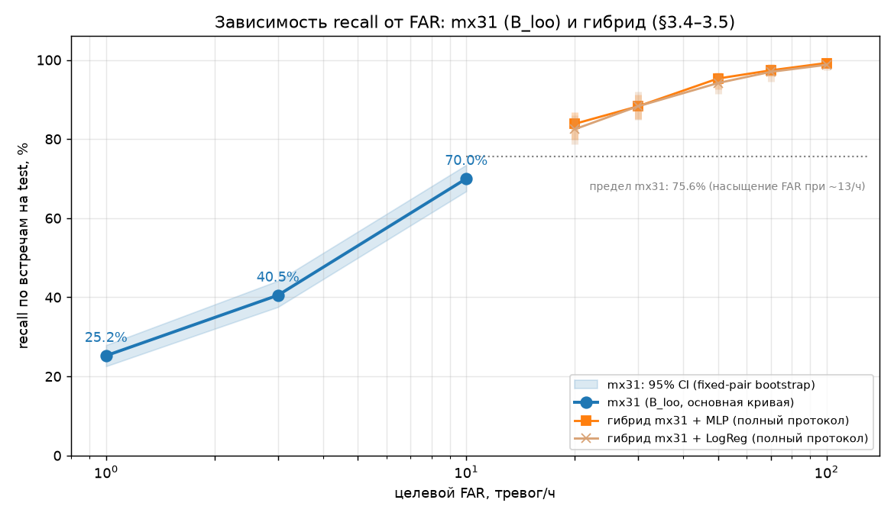
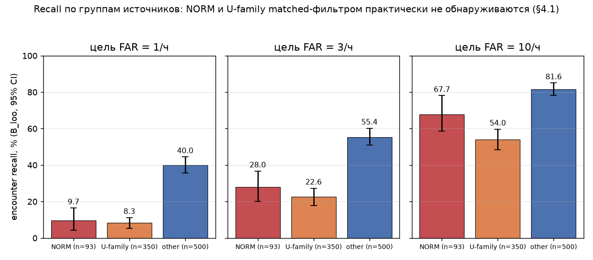

# ML-RADAI: обнаружение источников гамма-излучения в городском поиске с помощью matched-фильтра

[English](README.md) · [Русский](README.ru.md)

В репозитории исследуется **обнаружение аномалий — источников гамма-излучения** — в симуляционном наборе данных городского поиска
[RADAI](https://bdc.lbl.gov/wiki/public/radai-interactive-datasets/)
(`training_v4.3.h5`, ORNL/LBNL). Сцинтилляционный детектор NaI(Tl) на транспортном средстве движется
по смоделированному городу; требуется выдавать тревогу при проезде мимо скрытого источника, не превышая
практически допустимую частоту ложных тревог (FAR).

Основной результат работы — ноутбук [`Matched_Filter_Detection.ipynb`](Matched_Filter_Detection.ipynb).
В нём реализован пуассоновский matched-фильтр: модель фона из 7 обучаемых компонент, 61 изотопный шаблон
и агрегирование оценки окна скользящим максимумом за 62 с (**«mx31»**). Порог тревоги калибруется
по фоновым эпизодам на пуле leave-one-run-out (**B_loo**), а все доверительные интервалы получены
бутстрэпом по прогонам. Текст ноутбука написан на русском языке.

## Основные результаты

Тестовая выборка: прогоны 25–124, 943 встречи с источниками. Встреча считается обнаруженной, если
статистика тревоги превышает порог в пределах ±60 с от точки наибольшего сближения; тревогой считается
начало эпизода превышения порога. В квадратных скобках указаны 95 %-е бутстрэп-интервалы.

| целевой FAR, 1/ч | LogReg | XGBoost | MLP | одно окно (bestA) | **mx31 (B_loo)** |
|---|---|---|---|---|---|
| 1  | 6.9 % | 9.9 % | 4.7 % | 21.2 % | **25.2 %** [22.6–27.9] |
| 3  | 17.5 % | 18.6 % | 12.9 % | 28.1 % | **40.5 %** [37.5–44.2] |
| 10 | 38.7 % | 27.7 % | 31.7 % | 37.0 % | **70.0 %** [66.8–73.5] |

Первые три столбца — оконные классификаторы, обученные на двухсекундных спектрах (§2 ноутбука);
их ROC-AUC на отдельных окнах составляет всего 0.53–0.65.

Поскольку тревога определяется как эпизод, для mx31 частота ложных тревог не может превышать
примерно 13 эпизодов в час. В области более высоких FAR используется гибрид mx31 и оконного MLP
(логическое ИЛИ двух ветвей; §3.5):

| целевой FAR, 1/ч | 30 | 50 | 100 |
|---|---|---|---|
| mx31 + MLP, recall | 89.3 % [86.8–92.1] | 96.0 % [93.1–97.6] | 98.9 % [98.1–99.6] |

Эти интервалы получены по полному протоколу, в котором пересэмплируются и калибровочные, и оценочные
прогоны, поэтому они не содержат оптимизма, связанного с подбором порогов по тестовой выборке.

### Где метод не работает

Recall существенно зависит от типа источника. Две группы плохо обнаруживаются при низких FAR, так как форма
их спектров почти совпадает с формой урановой и ториевой компонент фона:

| группа источников | recall при FAR 1/ч | recall при FAR 10/ч |
|---|---|---|
| NORM (K-40, Th-232, Ra-226) | 9.7 % | 67.7 % |
| U-family (DU, LEU, NatU, RefinedU) | 8.3 % | 54.0 % |
| other (HEU, Pu, линейчатые источники, Cs-137, Sr-90, …) | 40.0 % | 81.6 % |

Это ограничение обсуждается в §4.1 и §6 ноутбука. Небольшая проверка на основе waterfall-CNN (§4.6), выполненная
по идее Bachleda et al., достигает уровня mx31 на этих группах, но не превосходит его. Результат показывает,
что информация в «сыром» спектрально-временном представлении присутствует, а предел задаётся классом модели,
а не физикой задачи.





## Содержание ноутбука

| раздел | тема |
|---|---|
| §0 | Задача, структура данных, термины, близкие работы, описание метода (самодостаточное введение) |
| §1 | Почему оконные классификаторы ограничены: нестационарность фона, малый вклад источника в одно окно |
| §2 | Базовые модели: LogReg, XGBoost и MLP на спектрах окон |
| §3 | Детектор на основе matched-фильтра, протокол калибровки порога, кривые recall–FAR, гибрид для высоких FAR, чувствительность к радиусу исключения |
| §4 | Анализ ошибок: recall по изотопам и группам, хвост ложных тревог и наложение импульсов, SNR при вероятности обнаружения 50 %, регуляризация Тихонова, проверка waterfall-CNN |
| §5 | Подходы, не давшие улучшения (отрицательные результаты) |
| §6 | Выводы и ограничения |

Остальные рисунки, создаваемые ноутбуком, сохраняются в каталоге [`figures/`](figures/).

## Получение данных

Файл `training_v4.3.h5` (около 26.6 ГБ) в репозиторий не включён (слишком большой размер; он указан в `.gitignore`).

1. Зарегистрируйтесь на [bdc.lbl.gov](https://bdc.lbl.gov/register) (академические заявки обычно одобряются примерно за сутки).
2. Скачайте обучающий набор RADAI v4.3 со [страницы набора данных](https://bdc.lbl.gov/wiki/public/radai-interactive-datasets/).
3. Сохраните файл в корне репозитория под именем `training_v4.3.h5`, рядом с `Matched_Filter_Detection.ipynb`.

## Запуск ноутбука

Используется Python 3.11. Версии пакетов зафиксированы в `requirements.txt`, так как часть результатов
чувствительна к версиям библиотек.

```
python -m venv .venv
.venv\Scripts\activate            # Windows
# source .venv/bin/activate       # Linux / macOS
pip install -r requirements.txt
python -m notebook Matched_Filter_Detection.ipynb      # интерактивный запуск
```

Возможен также запуск без интерфейса:

```
python _scratch/run_exec.py
# или
jupyter nbconvert --to notebook --execute --inplace Matched_Filter_Detection.ipynb
```

Ноутбук самодостаточен: все промежуточные кэши (`_scratch/*.pkl`) при отсутствии пересоздаются из исходного
`.h5`-файла, а каталоги `figures/` и `_scratch/` создаются автоматически. Полный «холодный» запуск
(новое ядро, пустой каталог кэшей, выполнение сверху вниз командой `jupyter nbconvert --execute`) занимает около
40 минут и точно воспроизводит все приведённые значения; основные результаты (25.2 / 40.5 / 70.0 %) проверяются
в ноутбуке утверждениями `assert`. Единственный ресурсоёмкий этап — §4.6: если файл `_scratch/t5_wf.pkl`
отсутствует, перед оценкой ноутбук автоматически запускает `python _scratch/t5_waterfall.py`
(PyTorch на CPU, фиксированное зерно генератора, около 10–20 из 40 минут).

## Структура репозитория

- `Matched_Filter_Detection.ipynb` — итоговый ноутбук, сохранённый со всеми результатами выполнения.
- `figures/` — PNG-файлы, сохраняемые ячейками ноутбука; часть из них используется в этом README.
- `_scratch/` — генератор ноутбука (`build_nb.py`), скрипт запуска без интерфейса (`run_exec.py`),
  отдельные проверочные скрипты, на которые ссылается §5 ноутбука, и их эталонные журналы `.out`.
  Воспроизводимые кэши (`*.pkl`, `*.log`) исключены из git.
- `requirements.txt` — зафиксированные версии зависимостей.

Ранние исследовательские ноутбуки (разведочный анализ данных, оконные LogReg / XGBoost / CNN, идеи адаптивного фона)
в репозитории больше не хранятся. Их выводы воспроизведены в §1–§2 ноутбука, а описание структуры набора данных,
которое в них содержалось, сверено с `.h5`-файлом и перенесено в §0.2.

## Литература

- Jones et al., *Adaptive NMF* (LBNL), [arXiv:2507.10715](https://arxiv.org/abs/2507.10715) — адаптивная модель фона с регуляризацией против NORM-подобных форм.
- Bachleda et al., *waterfall CNN* (PNNL), [arXiv:2607.00270](https://arxiv.org/html/2607.00270v3) — свёрточная сеть на сыром спектрально-временном входе.

Методические отличия от обеих работ изложены в §0.4 ноутбука. Численное сопоставление с ними невозможно, поскольку
определения FAR, границы встреч и разбиения данных различаются (см. §4.4 и §5).

## Набор данных и ссылки на источник

RADAI — синтетический набор данных городского поиска гамма-источников, созданный ORNL и LBNL (финансирование DOE NA-22).
Условия цитирования и лицензирования приведены на [странице набора данных](https://bdc.lbl.gov/wiki/public/radai-interactive-datasets/).
